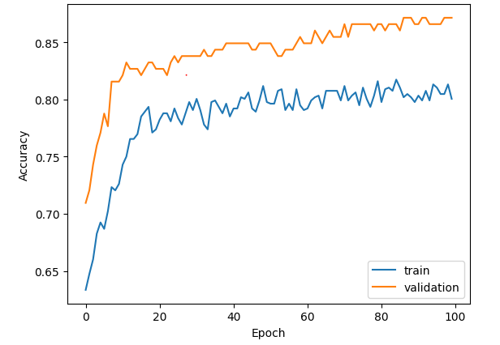

# Titanic Disaster with ANN

Kaggle competition: [Titanic - Machine Learning from Disaster](https://www.kaggle.com/competitions/titanic)

[Medium Blog](https://medium.com/%40lx9182/titanic-disaster-with-ann-a48bc9f81561)

Follow the notebook [Titanic.ipynb](Titanic.ipynb) to do below steps:

1. The Challenge
2. Data Understanding
3. Exploratory Data Analysis
4. Feature Engineering
5. Modeling and Evaluating

## Install libraries:

```
pip install pandas
pip install matplotlib
pip install seaborn
pip install tensorflow
```

## Why we do this project?

As a challenge from Kaggle, we are tested about machine learning skill. We will use a lot of machine learning techniques like feature engineering, data modeling,... to create a model with highest performance. And beyond that, we will be able to understand more about data, to make some assumptions, some predictions.
So what kinds of passenger are most likely to survive?

## Summary result

After training 100 epochs, model has 87% accuracy



## Licensing, Authors, Data
All belong to Kaggle: [Titanic - Machine Learning from Disaster](https://www.kaggle.com/competitions/titanic)